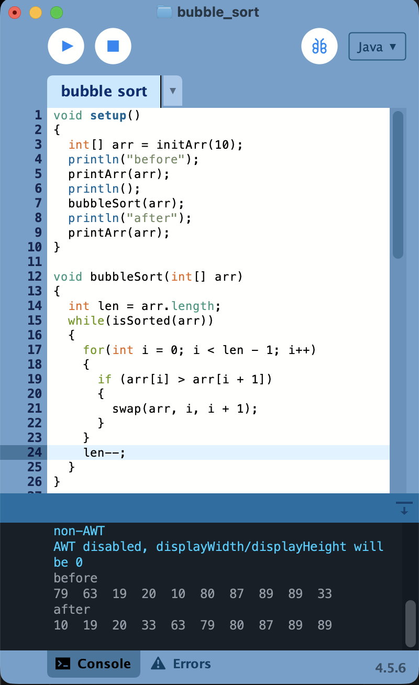
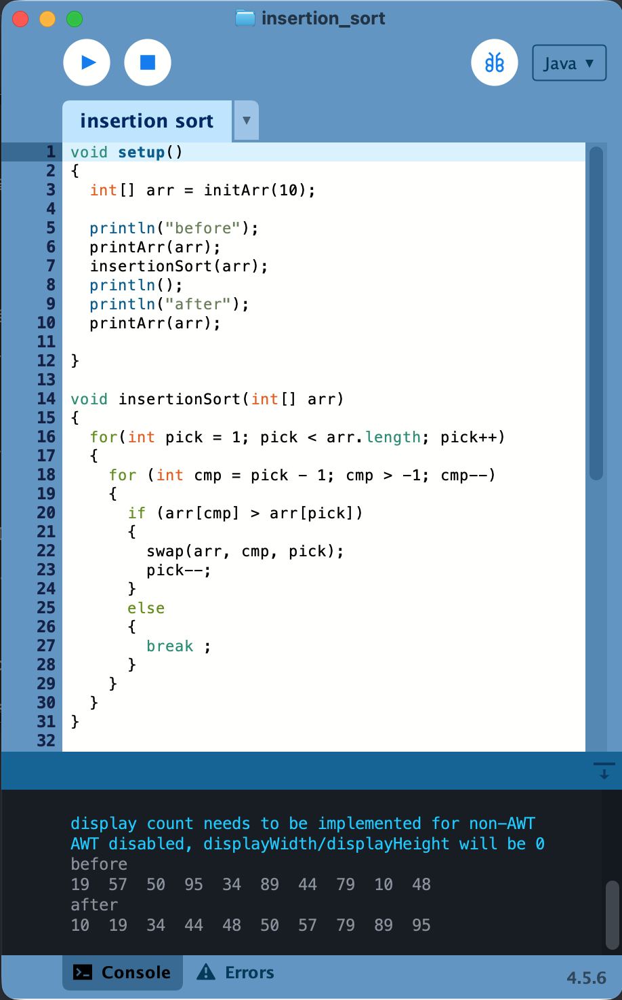
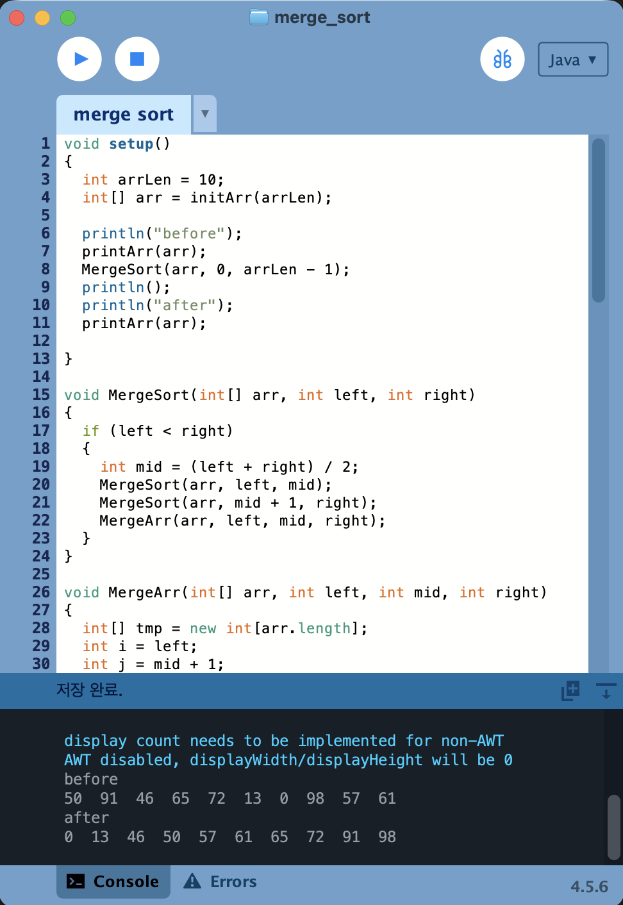
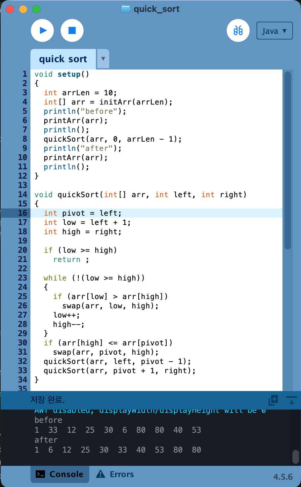
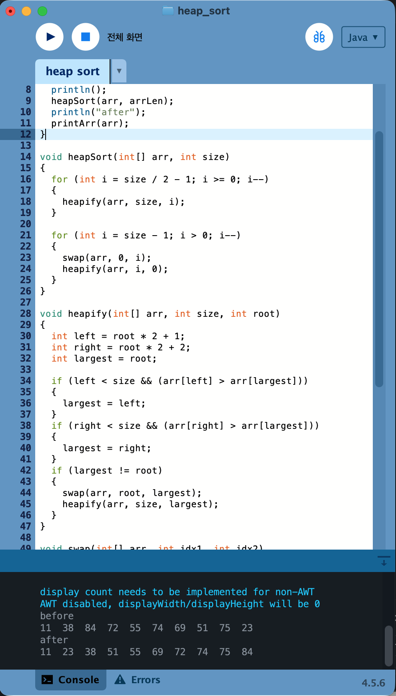

# algorithm_2026

### HOMEWORK1
[SelectionSorting](./homework/selection_sort.pde)

 

[BubbleSorting](./homework/bubble_sort.pde)

 

[InsertionSort](./homework/insertion_sort.pde)

 

[MergeSort](./homework/merge_sort.pde)

 

[QuickSort](./homework/quick_sort.pde)

 

[HeapSort](./homework/heap_sort.pde)

